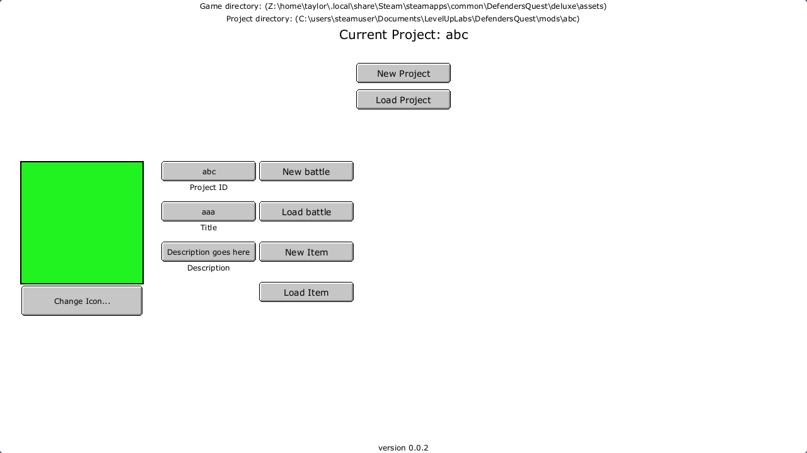
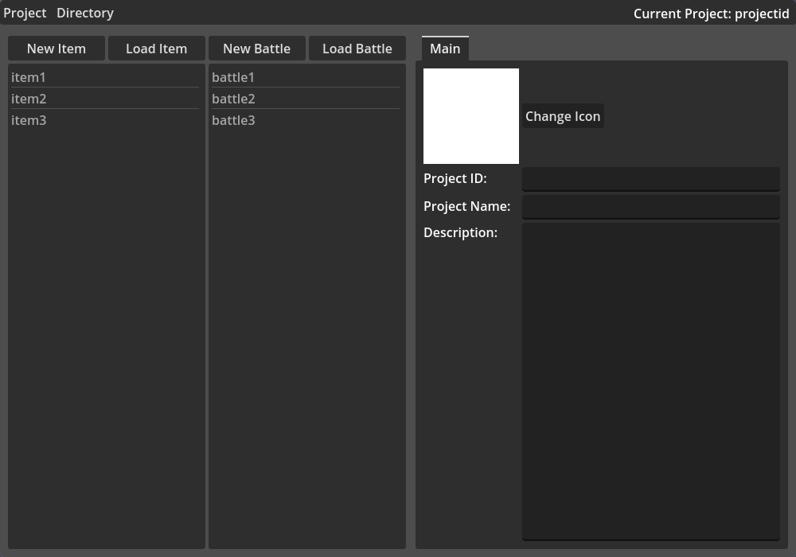
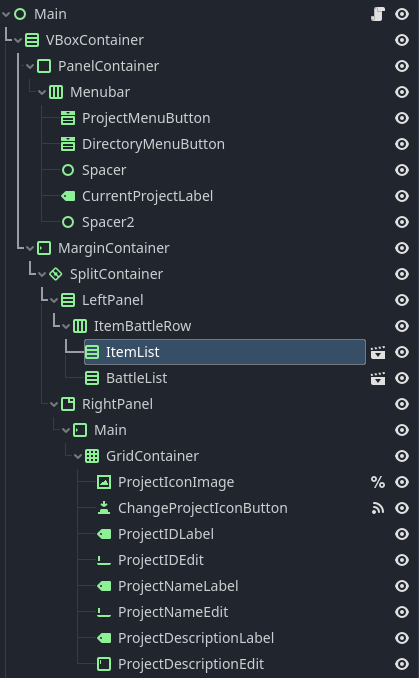
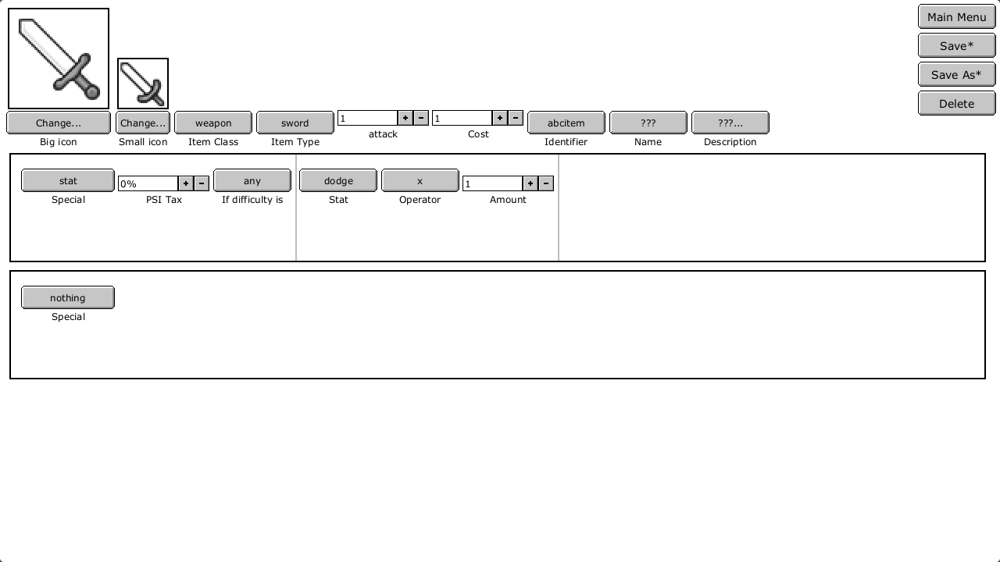
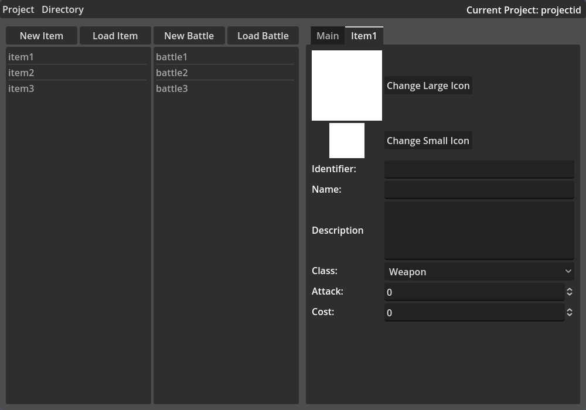

+++
title = "Writing Software in Godot (Part 1 / Planning and UI Layout)"
date = 2023-11-29
[taxonomies]
  series = ["Writing Software in Godot"]
+++

## Introduction

- [source code](https://github.com/cndofx/defenders-quest-mod-editor)

I want to make a mod editor for [Defender's Quest](https://store.steampowered.com/app/218410/Defenders_Quest_Valley_of_the_Forgotten_DX_edition/).
The game includes a mod editor already, but the UI is a mess, it's buggy,
and it doesn't run natively on linux. More importantly, I want experience
using godot to write non-game software and with godot in general. 
I also just want a project I can write about. 
I'll be using [godot v4.1](https://docs.godotengine.org/en/4.1/).

## The Plan

The mod editor needs to include an item editor and a map editor, along with
the ability to read and write the XML documents that the game uses for it's data.

In this part, I want to get the basic UI laid out for the main page and the item editor.
The map editor will be much more complex so I'll worry about that later.

In part 2, I want to write a basic XML reader and writer in GDScript. Godot
has an [XMLParser](https://docs.godotengine.org/en/stable/classes/class_xmlparser.html)
class built in, but it's not very ergonomic and doesn't do quite what I want.
It also doesnt have support for writing XML files, so I'll just try to come
up with something that can do both. XML is a complex format, but the files
I need to work with seem pretty basic, so a simple implementation shouldn't
be too hard.

In part 3, I'll get the UI functionality all hooked up and hopefully have the 
item editor at least partially working. This part will really test my knowledge
of godot design patterns, as there's a lot of moving parts and a lot of state
to manage. I plan on using [RefCounted](https://docs.godotengine.org/en/stable/classes/class_refcounted.html)
objects to store my data in memory and just having methods to convert those objects
to and from XML, but I'll see about that when I get there.

After all that, I want to make a map editor, but it's not part of the plan yet
as I don't know how complex it'll be. I want to look into how
[Pixelorama](https://github.com/Orama-Interactive/Pixelorama) (a pixel sprite editor made in godot)
works, and maybe see how some other godot developers have implemented a level editor in their games.

## Main UI

UI layout isn't particularly interesting so I don't have too much to write about,
but I do have some progress to show and a few important points to note.

- For all UI made in godot, but especially in software like this, it's important
to make use of godot's containers and anchors to lay out the controls rather 
than manually position them so that everything plays nicely when the window is resized.
MarginContainer, VBoxContainer, HBoxContainer, and GridContainer are all very commonly used.

- Godot has a `application/run/low_processor_mode` property under project settings that 
prevents the screen from being redrawn if nothing visual has changed.

This is what the original mod editor looks like:



This is what mine looks like:



And this is what the scene tree currently looks like:



Currently, only the ItemList and BattleList nodes (highlighted)
are separated into their own scenes. They are going to have very
similar functionality but don't share anything right now, so 
this will be changed later. 

I'm keeping most things all in the same scene for now as I don't know
how I'll be hooking everything up yet. Once I get to the code, I'll
revisit my structure.

## Item Editor UI

This is the original item editor:



And mine:



It's missing the "Item Type" field and also the very important "Special"
stat editors for now, but the layout and content of those both change
depending on their state, so they'll have to wait until I add some code.

## Problems and Next Steps

I'm happy enough with the state of the UI so far. The only real issue I see
so far is how I'm going to implement an "X" close button on the item and battle
editor tabs. It might also be good to put the two item and battle panes on the
left under another tab group to free up some space, but I'm not worried about
that yet.

Next, I want to be able to load, edit, and save a mod. I'll need to write a
parser and writer for this simple XML format:

```xml
<settings>
	<mod id="abc"/>
	<game name="DQ1" version="???"/>
	<creation_date year="2023" month="10" day="1" hour="18" minute="46" second="0"/>
	<modified_date year="2023" month="10" day="1" hour="18" minute="46" second="0"/>
	<title value="aaa"/>
	<description value="Description goes here"/>
	<visibility value="public"/>
	<tags value="deluxe"/>
	<author id="" name=""/>
	<steam id=""/>
	<changelog current="null">

	</changelog>
</settings>
```

That's all for now!

## Useful Resources

- [Godot UI Basics](https://www.youtube.com/watch?v=1_OFJLyqlXI) by Godotneers
- [Every Control Node Used and Explained](https://www.youtube.com/watch?v=sb6xe87RUE4) by SDG Games